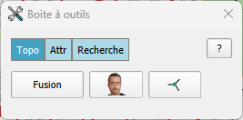
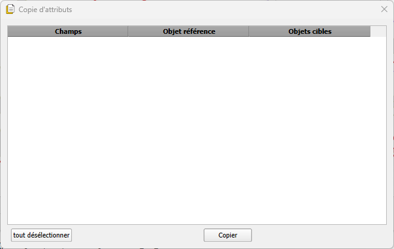
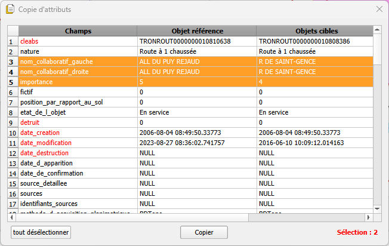
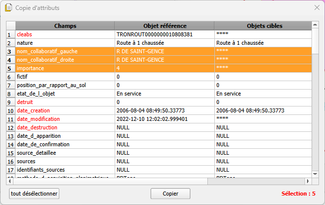
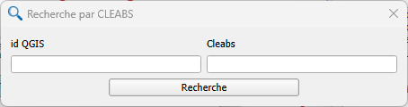
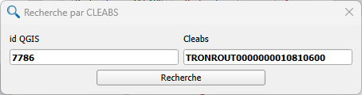

<table>
<colgroup>
<col style="width: 21%" />
<col style="width: 78%" />
</colgroup>
<tbody>
<tr>
<td rowspan="2"></td>
<td style="font-size: 24px;text-align: center;">
<strong>Manuel utilisateur du plugin
« Boîte à outils »</strong>

<strong>V0.2.1</strong>
</td>
</tr>
<tr>
<td style="font-size: 16px;text-align: center;">Développeur  : Gérôme PECHEUR (IGN)</td>
</tr>
</tbody>
</table>

## Sommaire

- [1. Prérequis](#prerequis)

- [2. Résumé](#resume)

- [3 Présentation](#presentation)

- [4 Onglet « Topo »](#onglet-topo)

	- [4.1 Fusion](#fusion)

	- [4.2 ](#section)

- [5 Onglet « Attr »](#onglet-attr)

	- [5.1 Copie d’attributs](#copie-dattributs)

- [6 Recherche](#recherche)

	- [6.1 « Recherche par CLEABS »](#recherche-par-cleabs)

	- [6.2 « Recherche »](#recherche_1)

  <h2 id="prerequis" style="color: white;margin:0;" >1. Prérequis</h2>

- Version de QGIS : 3.28 ou supérieur

- Le plugin « maitre » doit préalablement être installé : 
[maitre-qgis-plugin sur GitHub](https://github.com/IGNF/maitre-qgis-plugin)

  <h2 id="resume" style="color: white;margin:0;" >2. Résumé</h2>

Ce plugin regroupe diverses fonctionnalités accessibles via des onglets

- Topologie (fusion d’entités, mode d’accrochage des sommets pour
  déplacer des entités)

- Attr (copie d’attributs d’une entité à un autre)

- Recherche (recherche par cleabs, recherche via des requêtes sql)

  <h2 id="presentation" style="color: white;margin:0;" >3. Présentation</h2>

Chaque onglet regroupe plusieurs fonctionnalités

  <h2 id="onglet-topo" style="color: white;margin:0;" >4. Onglet « Topo »</h2>

  <h2 id="fusion" style="color: white;margin:0;" >4.1 Fusion</h2>

Pas encore implémenté

  <h2 id="via" style="color: white;margin:0;" >4.2	</h2>

C’est un outil « d’accrochage »

 : Accrochage désactivé

 : Accrochage activé

On a une entité sélectionnée et elle partage un même sommet avec
d’autres entités dans QGIS :

- Lorsque l’accrochage est désactivé :

Le déplacement du sommet commun ne déplace que le sommet de l’objet
sélectionné.

- Lorsque l’accrochage est activé :

Le déplacement du sommet commun déplace ce sommet pour toutes les
entités.

  <h2 id="onglet-attr" style="color: white;margin:0;" >5. Onglet « Attr »</h2>

  <h2 id="copie-dattributs" style="color: white;margin:0;" >5.1 Copie d’attributs</h2>

Cette interface permet la copie d’attributs d’une entité vers une ou
plusieurs autres.

À l’ouverture, cette interface est vide. Elle
s’initialise dès lors qu’au moins deux entités sont sélectionnées.\
La première entité sélectionnée sert de référence, les autres
constituent les entités cibles.

Attention à la sélection par rectangle, main levée ou polygone (l’objet
cible sera aléatoire).

Apres sélection de 2 entités :

En rouge : les champs en lecture seuls

En orange : les attributs différents entre l’entité de référence et
l’entité cible.

Apres sélection de plus de 2 entités :

Idem que pour la sélection de 2 entités sauf :

Les « \*\*\* » correspondent à des valeurs d’attributs différents entre
les entités cibles.

La copie ne s’effectue que sur les attributs en orange ;

Il est possible de sélectionner/désélectionner d’autres attributs.

  <h2 id="recherche" style="color: white;margin:0;" >6. Recherche</h2>

  <h2 id="recherche-par-cleabs" style="color: white;margin:0;" >6.1 « Recherche par CLEABS »</h2>

Cette recherche s’effectue de la CLEABS vers id QGIS

On renseigne une CLEABS et on clique sur « Recherche » :

L’entité correspondante est sélectionnée.

QGIS fait clignoter et zoom sur cette entité.

  <h2 id="recherche_1" style="color: white;margin:0;" >6.2 « Recherche »</h2>

Pas encore implémenté
